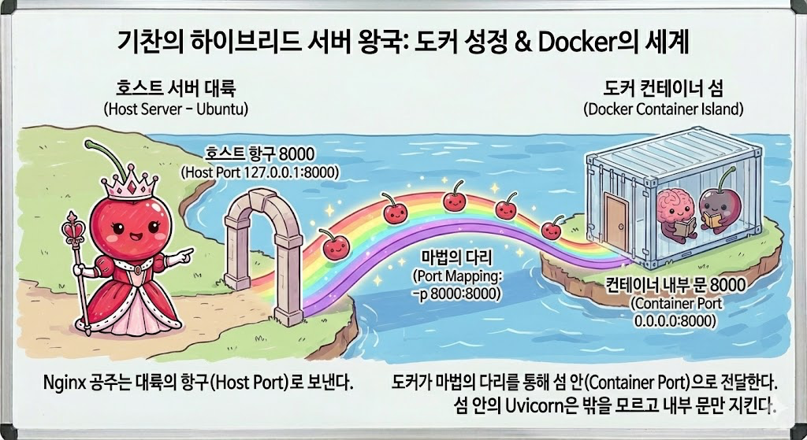

# ✨ My Start Page

<div align="center">


**A personal browser start page with glassmorphism UI** 🚀

🔗 **Live Demo:** [startpage.bit-habit.com](https://startpage.bit-habit.com)

</div>

---

## 📸 Screenshot



---

## ✨ Features

- 🔗 **Link Management** — Add, delete, reorder bookmarks by section
- 🎨 **Glassmorphism UI** — Modern frosted glass design with neon accents
- 🔍 **Quick Search** — Naver & YouTube search built-in
- 🎨 **Theme Colors** — 6 neon color themes per section
- 🔐 **Simple Auth** — Password-protected admin actions
- 📱 **Responsive** — Works on mobile, tablet, desktop

---

## 🚀 Quick Start

```bash
# Clone & run
git clone https://github.com/bookseal/my-start-page.git
cd my-start-page
pip install -r requirements.txt
uvicorn main:app --host 0.0.0.0 --port 8000
```

```bash
# Or use Docker
docker build -t my-start-page .
docker run -d -p 8000:8000 -e ADMIN_PASSWORD=yourpassword my-start-page
```

---

## ⚙️ Environment Variables

| Variable | Description | Default |
|----------|-------------|---------|
| `ADMIN_PASSWORD` | Admin password | `1234` |
| `LINKS_FILE` | Links data file path | `links.json` |

---

## 🛠️ Tech Stack

**Backend:** FastAPI + Uvicorn  
**Frontend:** Jinja2 + Tailwind CSS  
**Storage:** JSON file (no DB required)

---

<div align="center">

Made with 💜 by [bit-habit.com](https://bit-habit.com)

</div>
